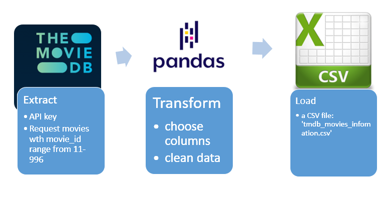
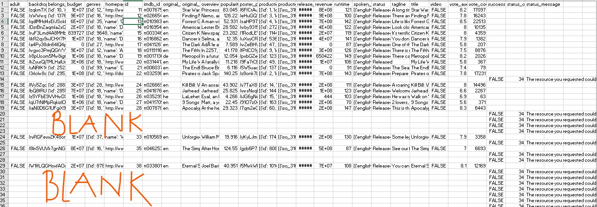
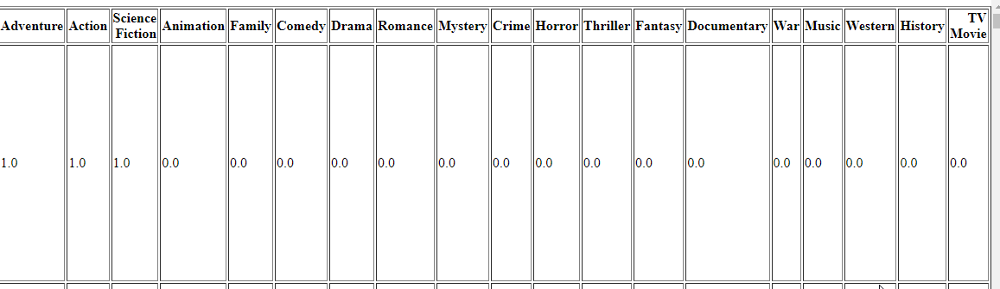
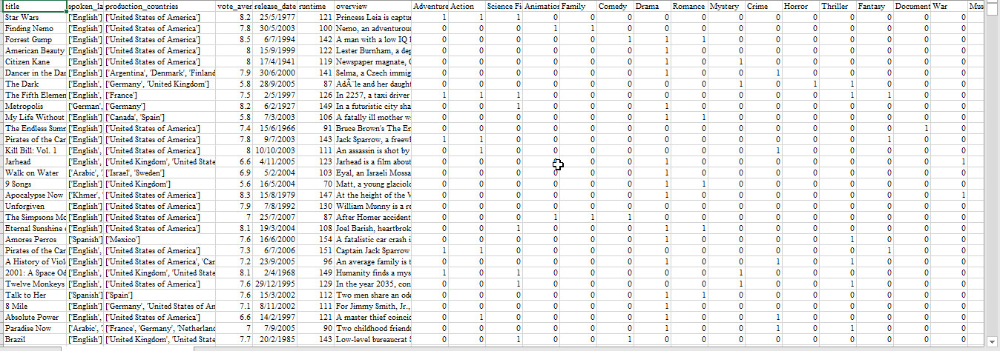

# ETL pipeline using Pandas in Python
## Video Demo:  <URL HERE>
## Description:

In this project, I will make a ETL pipeline (extract – transform – load) data from a website name The Movie Database API. First, I create an account and obtain an API key to make requests data from it.
As I don’t want to put my API directly into my source code, I create a file called config.py

	#config.py
	api_key = 'my api key'

I want to see original data extracted from the website, so I create original_Data.py to create a csv file (without any transform or cleanning data). This step helps me to figue out what I want to do with this data, how would I clean it.

Then I create a file called createCSV.py. this file’s input is my API key and out put is a CSV file. That is the data from the website after ETL pipeline.
First I import necessary items:

	import pandas as pd
	import requests
	import json
	import config

### Extract

The original data has 28 columns and 984 values, but there are many values are blank:
 
	
	

I send a single GET request to the API. In the response, I receive a JSON record with the movie_id that I specify from 11 to 996.
At this part, I also eliminated blank value and only add to response_list when it not “blank”. 
	
	def get_response_list():
		for movie_id in range(11,996):
        	r = requests.get('https://api.themoviedb.org/3/movie/{}?api_key={}'.format(movie_id, API_KEY))
		if not ('success' in r.json() and str(r.json()['success']) == "False"):
		response_list.append(r.json())

### Transform

The original data has 28 columns and I only want to work with some collumn so I create list of column names called df_columns that allows us to select the columns we want from the main dataframe.
	
	df_columns = ['title', 'spoken_languages','production_countries', 'vote_average', 'release_date', 'runtime', 'overview']

now, I clean the data from each collumn as I expect.

First, this is the fomat of collumn production_country, I only want to keep “name: ‘United Kingdom”

*'production_countries': [{'iso_3166_1': 'GB', 'name': 'United Kingdom'}*

So I make the function “get_production_countries” to do it:

	def get_production_countries(countries):
		production_countries = []
		for l in countries:
			r = []
			for d in l:
				r.append(d['name'])
        production_countries.append(r) 
		return production_countries 

secondly, this is the format of “spoken_languages” and I only want to keep ‘english_name’ of it:

*'spoken_languages': [{'english_name': 'English', 'iso_639_1': 'en', 'name': 'English'}]*

So I make the function “get_spoken_languages” to do it:

	def get_spoken_languages(languages):
    	spoken_languages = []
    	for l in languages:
        	r = []
        	for d in l:
            	r.append(d['english_name'])
        	spoken_languages.append(r)  
    	return spoken_languages           

with the genre, it is a bit complicate

*'genres':* 
*[{'id': 80, 'name': 'Crime'}, {'id': 18, 'name': 'Drama'}, {'id': 53, 'name': 'Thriller'}]*

I decided to make different collumn for each genre, and if the movie in that genre, it will return 1 in that collumn, or else, it will return 0. Like this: 
 
 
 
I creat a separate table for genres and a column of lists all genres
 
	def get_genres(genres_list):
    	result = []
    	for l in genres_list:
        	r = []
        	for d in l:
            	r.append(d['name'])
        	result.append(r)    
    	return result

from that genres list, I creat list of unique genres, and make data frame for it

	def get_unique_genres(genres_list):
    	flat_list = []
    	for sublist in genres_list:
        	if isinstance(sublist, list):
            	for item in sublist:
                	flat_list.append(item)
    	df_genres = pd.DataFrame.from_records(flat_list).drop_duplicates()
    	return df_genres['name'].to_list()

I put all genres column in to my table, and put 0/1 in to the value of each genre 

	df_columns.extend(get_unique_genres(genres_list))
	s = df['genres_all'].explode()
	df = df.join(pd.crosstab(s.index, s))

### Load

I ended up creating a table for the tmdb schema that I export my tables by writing them to file. This will create  .csv files in the same directory that my script is in.

	df[df_columns].to_csv('tmdb_movies_infomation.csv', index=False)
	
 and finally, this is the result after my ETL pipeline:
 

